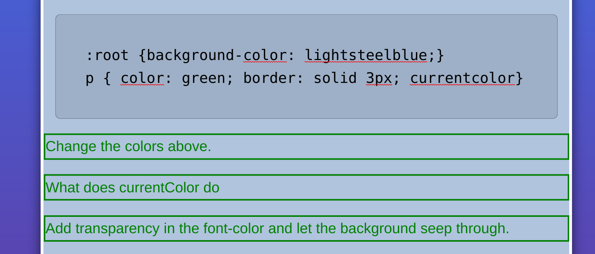
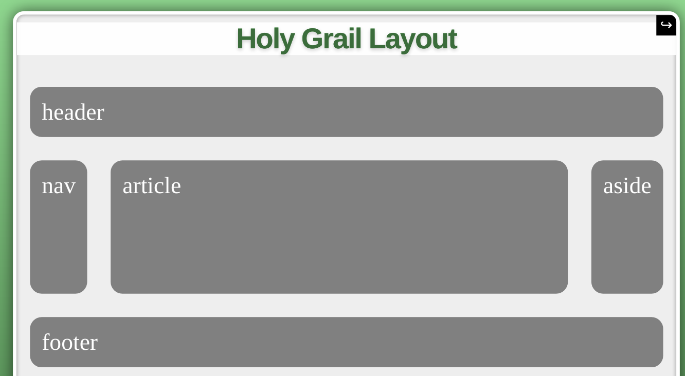
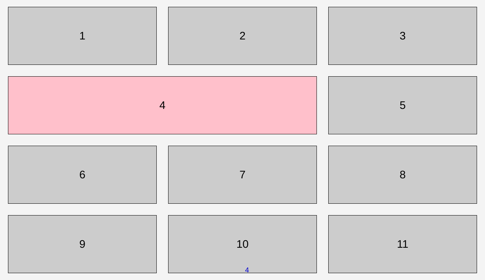
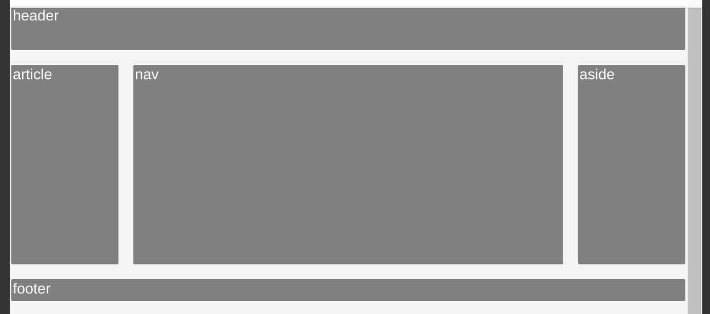

My notes from: https://frontendmasters.com/courses/css-in-depth-v2/

Slides: https://estelle.github.io/cssmastery/#slide1

### Intro

https://estelle.github.io/cssmastery/intro/index.html#slide1

^ In the example on slide 1, the following CSS3 features are present:

- css3 selectors
- linear gradients
- opacity
- rgba colours
- border-radius
- transforms
- transitions
- animations
- text-shadow
- fonts

### CSS Intro

**C**ascading **S**tyle **S**heets — the presentation layer of the web

Content (HTML) --- Presentation (CSS) --- Behaviour (JS)

Several ways to include CSS:

1. external style sheet

   ```html
   <link href="stylesheet" href="path/file.css" />
   ```

   best for websites - heavy download, but only once as we can cache it

2. embedded styles 

   ```html
   <style>
       body {}
   </style>
   ```

   good if we have a single page website - not for a whole site as we'd be downloading styles every page load

3. inline styles

   ```html
   <p style="color: black">Lorem ipsum</p>
   ```

   quick and dirty - test something out, then put into one of the above

:heavy_check_mark: Why use external stylesheets?

- reusability
- maintainable
- changes are sitewide
- changes are instantaneous
- interchangeable presentation layer

most importantly: **it decouples content from presentation**

### Basic Selectors & CSS Levels

https://estelle.github.io/cssmastery/selectors/index.html#slide1

**Basic Selectors**

```html
<ul>
    <li id="myID" class="myClass">item 1</li>
    <li class="myClass">item 2</li>
    <li>item 3</li>
</ul>
```

3 ways to target:

- target `#myID` - ID

- target `.myClass` - class

- target the `li` - html tag name - **preferable**

There are many kinds of selector: https://css4-selectors.com/selectors/

### Specificity Introduction


### Relational Selectors & Combinators

https://www.w3schools.com/css/css_combinators.asp


Targeting with **querySelector** natively:

```javascript
var el = document.querySelector('#bar');
var chil = el.querySelectorAll('.foo');
```

And we can remove and add classes with **classList.add** and **classList.remove**

### Attribute Selectors

**element[attribute]** - Select elements containing the named attribute with any value

```css
img[alt] {}
	
	/*  */ 
form [type] {}
	<input type=date>
	/* <select> */
```

In addition:

**element[attritube = "val"]** - matches the exact value

**element[attribute |=  "val"]** - matches value + anything after it

^ useful for languages

```css
p[lang|="en"]{/* <p lang="en-us">  <p lang="en-uk"> */ }
```

... and more:

**element[attr ^= val]** - element whose attribute starts with val - useful for matching links

```css
a[href^=mailto] {background-image: url(emailicon.gif);}
a[href^=http]:after {content: " (" attr(href) ")";}
```

**element[attr $= val]** - element whose attribute ends in val - e.g. tell me a link downloads a PDF by appending that info:

```css
a[href$=pdf] {background-image: url(pdficon.gif);}
a[href$=pdf]:after {content: " (PDF)";}
```

**element[attr *= val]** - match attribute anywhere 

Case insensitivity, add `i` - only relevant if attr val is case sensitive

```css
E[foo="bar" i]
```

```css
input[type="checkbox" i]
```

https://codepen.io/estelle/pen/lEGev

### Attribute Selectors Recap

play around with the examples: https://estelle.github.io/cssmastery/selectors/#slide28

e.g.


### User Interface Selectors

e.g. if there's a *checked* checkbox, make it red.

```css
input[type=checkbox]:checked + label {
    color: red;
}
```

https://developer.mozilla.org/en-US/docs/Web/CSS/Pseudo-classes

```css
:default
:valid
:invalid

:required
:optional

:in-range
:out-of-range

:read-only
:read-write

:placeholder-shown

:user-error
/* or */
:user-invalid
```

e.g.


If you know your HTML attributes CSS can become very powerful and take up a lot of the work you had JS doing before.

### Structural Selectors

```css
:root
:empty
:blank
:nth-child()
:nth-last-child()
:first-child*
:last-child
:only-child
:nth-of-type()
:nth-last-of-type()
:first-of-type
:last-of-type
:only-of-type
```

- Target elements on the page based on their relationships to other elements int the DOM
- Updates dynamically if page updates
- Reduced need for extra markup, classes and IDs

e.g. https://estelle.github.io/cssmastery/selectors/files/04_firstlastonly.html try these out:

```css
body div:first-child { color: hsl(205, 87%, 50%); text-decoration: underline;}
```

```css
body :last-child { color: hsl(205, 87%, 50%); text-decoration: underline;}
```

```css
body :last-of-type { color: hsl(205, 87%, 50%); text-decoration: underline;}
```

^ the prepended `body` is a bug in these examples

### nth-of-type Structural Selectors

e.g.

```css
:nth-child(3n)
:nth-last-child(odd)
:nth-of-type(5)
:nth-last-of-type(3n+1) 
```

`nth-of-type`

```css
:nth-of-type(even)
:nth-of-type(odd)
:nth-of-type(an+b)
```

https://estelle.github.io/selectors/#slide33 (older slides - not broken)


### Structural Selectors Demo

https://estelle.github.io/cssmastery/selectors/#slide43

### Root, Empty & Blank

```css
:root	
```

Selects the document root, which is `<html>`

```css
E:empty
```

```css
<E/>
<E></E>
<E><!-- this is a comment --></E>
<E title="this is an empty element"/>
```

```css
E:blank
```

```css
<E>   <!-- has white space -->   </E>
```

^ but not supported yet?

but you can use `:-moz-whitespace-only` in firefox...

https://developer.mozilla.org/en-US/docs/Web/CSS/:-moz-only-whitespace

### Negation, Matching & Parent

```css
E:not(s1) /* matches any element that is not also matched by s1*/
```

```css
div:not(.excludeMe) /* matches any div except for ones with class .excludeMe */
```

Safari Only:

```css
E:not(s1, s2)
```

```css
div:not(.excludeMe, .excuseYou)
```

e.g.

```css
li:first-child {
  color: blue;
  font-weight: normal;
  }
li:not(:first-child) {
  color: red;
  font-weight:bold;
  }
```


---

(talking about `:matches`, `:any`, :`has` which are still experimental)

https://caniuse.com/

e.g. 

`:has` - not supported - https://caniuse.com/?search=%3Ahas

`:matches` - kind of supported - https://caniuse.com/?search=%3Amatches

---

### Linguistic Pseudo Classes

```css
F[attr|=val]

html[lang|="en"] /* would match: en, en-us, en-uk, etc. */

p:lang(en)
```

### Link, Locations & User Action

`a` with an `href` attribute

```css
:link
:visited
```

`:any-link` is the same as: `:matches(:link, :visited)`

**User Action Pseudo Classes**

```css
:hover
:active
:focus
```

*always style `:focus`* when you style `:hover` 

```css
:focus-ring
:focus-within
```

```css
:drop
:drop()
```

e.g.

```css
a:visited:hover /* hovering over a visited link can be a different style to a non-visited link - some (most) browsers do this by default? */

button:active:focus
```

**Drag and drop pseudo classes**

https://estelle.github.io/cssmastery/selectors/#slide60

**:target**

```css
:target
```

```html
<!-- myPage.html#anchor e.g. #slide63 = the browser knows we're on slide63 -->

<div id="anchor">abc...</div>
```

```css
div:target::fist-line {
    font-weight: bold;
}
```

e.g.

https://estelle.github.io/cssmastery/selectors/#slide63


"Whatever tab is selected, make it white, otherwise make it gray. Whatever tab is selected, bring it to the front of the page (z-index) and push the others back."

**:scope**

Matches elements that are a reference point for selectors to match against. (Doesn't exist yet...)

**Grid-structural selectors**

Column combinator

```css
E || F
```

```css
col.selected || td {
    /* matches all cells within the column's scope */
}
```

```css
:nth-column(An+B)
:nth-last-column(An+B)
```

**Time dimensional**

```css
:current
:future
:past
```

https://css4-selectors.com/selector/css4/time-dimensional-pseudo-class/ (again, doesn't exist yet... so what's the point putting all this into the presentation???)

### Specificity 


Try to avoid **div**itis and **ID**itis (hence the shark as it isn't as cute as the plankton or fish)

inline styles = BP oil tanker (very bad)

`!important` - never use in production. Acceptable as a debugging tool: "Why isn't my CSS working? OK let's see what it should be like with `!important`, etc."

**Example: Hacking Specificity with IDs**

```css
#TheirWidget {background-color: blue !important;}
#3rdPartyWidget {background-color: white;}
```

```css
#TheirWidget#TheirWidget {background-color: blue ;}
#3rdPartyWidget {background-color: white;}
```

Always comment what you're doing when you play with hacks like this.

**Example: Worst case scenario hack of !important**

```css
li {
    color: white !important;
}
```

can be overridden with an animation!

```css
li {
    animation: color forwards;
	}
@keyframes color {
    100% { color: #f50; }
}
```

### Introduction to Pseudo-Elements

```css
::first-line
::first-letter
::selection (not in spec)
::before
::after
```

**pseudo-classes** select elements that already exist.

**pseudo-elements** create faux elements you can style

Example:

```css
p:first-of-type::first-letter {
	position: relative;
	top: 8px;
	float: left;
	font-size: 3em;
	line-height: 1;
	color: hsl(205, 87%, 50%);
	padding: 0 4px 2px 0;
	font-weight: bold;
}
```


### Before, After and Generated Content

e.g.

```css
p:before {
	content: '- before';	
}
p:after {
	content: '- after';	
}
```

```html
<p> the quick brown fox ... </p>
```

--> **- before the quick brown fox ... - after**

---

**additional pseudo-elements**

```css
::selection
::inactive-selection
::spelling-error
::grammar-error
```

**other pseudo-elements**

```css
::marker
::placeholder
::content
```

### Selection & More Pseudo-elements

You might want to disable `::selection` when on mobile (and sometimes desktop) apps when the user clicks over something for too long. The native feature might start to show you a copy/paste dialog, which you want to override. e.g. an app with drag and drop ???

```css
.thisSlide {
    -webkit-tap-highlight-color: #bada55;
    -webkit-user-select: none;
    -webkit-touch-callout: none;
}
```

There are lots of browser-specific elements (differences between browser scroll bars, and so on...)

"Shadow DOM"

e.g.

```css
.scrollbar ::-webkit-scrollbar {
	margin-right: 5px;
    background-color: #f36;
    border-radius: 6px;
    width: 12px;
}
/* etc. */
```

If you want to find out what's going on behind the scenes in your browser, the dev tools (f12) will reveal all.

### Before and After

continued...

before/after are **within** the target:


### Counters

```css
body {counter-reset: sections;}
header h1.sectiontitle:before{
		content: "Part " counter(sections) ": ";
    	counter-increment: sections;
}
```

^ Reset the counter (called sections) every time we reach a section. +1 every time we hit a `<h1>`. Saves us having to put everything in an ordered list `<ol>` to count it. Need to explicitly say `counter-increment`. 

### Quotes & Attributes

```css
/* Specify pairs of quotes for two levels in two languages */
:lang(en) > q { quotes: '"' '"' "'" "'" }
:lang(fr) > q { quotes: "«" "»" "’" "’" }

/* Insert quotes before and after Q element content */
q::before { content: open-quote }
q::after  { content: close-quote }
```

example:


### Counters Review

[example](https://estelle.github.io/cssmastery/generated/#slide17)

```css
body {counter-reset: invalidCount;}
:invalid {
  background-color: pink;
  counter-increment: invalidCount;
}
p:before {
  content: "You have " 
      counter(invalidCount) " invalid entries";
}
```


[another example](https://estelle.github.io/cssmastery/generated/#slide18)

```css
body { counter-reset: pagecount; }
p { 
	counter-increment: pagecount;
}
p:after { color: magenta;
  content: " " counter(pagecount);
}
```


### Images


### Strings & Special Characters


### Icon Accessibility 

e.g.

```css
[class|='material-icons']:after { 
  content: "\e84e";
  content: "bed";
  color: blue;
}
.material-icons {
  font-size: 3rem;
}
```

```html
<link href="https://fonts.googleapis.com/icon?family=Material+Icons" rel="stylesheet">
<!-- ... -->
<p class="material-icons">accessibility<p>
```


needs `-webkit-font-feature-settings: 'liga';`

### Design Elements

Thought bubbles example


see this for more: https://css-tricks.com/the-shapes-of-css/

and more ... https://estelle.github.io/cssmastery/generated/#slide38

### Media Type, Screen Size & Resolution

https://estelle.github.io/cssmastery/media/#slide1

We use **media queries** to change the presentation layer depending on what screen (browser, actually -- called the viewport) we're viewing from (size in pixels, orientation, etc.).

e.g.

```css
@media screen and (max-width: 600px) {
  #presentation {
    background: red;
      /* turn the background red when the 			 screen is < 600 px wide */
  }
}
@media screen and (orientation: portrait) {
  #presentation {
    background: yellow;
    /* turn the background yellow when the 		   screen is taller than it is wide   		   (portrait) */
  }
/* 1st query overrides 2nd? */
```

Media Features: https://estelle.github.io/cssmastery/media/#slide9

**Resolution Units**

- dpi: dots per inch
- dpcm: dots per cm (1 dpcm ~ 2.54 dpi)
- dppx: dots per pixel (1 dppx = 96 dpi)

Efficient to serve higher/lower quality images depending on the users' screen resolution. E.g. When a user has a high DPI screen, serve a high resolution image.

e.g.

```css
@media (-webkit-min-device-pixel-ratio: 2), /* Safari */
       (min-resolution: 192dpi) /* Everyone else */ 
		{
    		/* CSS */
		}
```

Images are typically served at 72, maybe 96 dpi. Sometimes we might go up to 300 though. Maybe we're printing an image? Or we're doing something that needs high quality? 

Demo: https://estelle.github.io/cssmastery/media/files/mediaqueries.html

### Syntax & Punctuation

`only` leaves out older browsers

```css
media="only print and (color)"
```

`and` - both parts must be true

```css
media="only screen and (orientation: potrait)"
```

`not` - if untrue

```css
media="not screen and (color)"
```

A `,` separates selectors - any part can be true

```css
media="print, screen and (min-width: 480px)"
```

`<` , `>` , and `>=` are coming soon. Won't have to do `min-width` and `max-width` all the time.

### Browser Capability @supports

`@supports` checks browser can do something before trying it

```css
@supports (display: flex){
	/* ... CSS stuff if the browser can do flex box */
}
```

https://codepen.io/estelle/pen/ihsny

e.g. https://estelle.github.io/cssmastery/media/files/typowidth.html

```css
@media screen and (min-width: 38em){
  #content { padding: 0 21%; }
}
```

|                    small screen (< 38em)                     |                    larger screen (> 38em)                    |
| :----------------------------------------------------------: | :----------------------------------------------------------: |
|  |  |

^ puts in a margin of 21% when we're on a larger screen.

### Use Cases: Hyphenations

```css
@media screen and (max-width: 38em){
  #content { padding: 0 21%; }
}
 p {
  hyphens: auto;
}
```

^ useful when we're on a small screen and don't long words to break onto a new line.

### Use Cases: Columns

e.g.

```css
column-count: 1;
column-width: 10em;
column-rule: 1px solid #bbb;
column-gap: 2em;
```

Have a play around to learn what this does: https://estelle.github.io/cssmastery/media/#slide26

It's nice to use columns with media queries, and we can do that without using `@media`:

```css
#content {columns: 18em 3;}
h1 {column-span: all;}
```

Each column must be at least 18ems wide. If there is space enough for 3, render 3. If are screen is for example only 40ems wide, for example, then generate just 2 columns. etc.

https://estelle.github.io/cssmastery/media/#slide27

### Use Cases: SVG

With SVGs, the width is the width **of the container** of the SVG.

https://estelle.github.io/cssmastery/media/files/circlesvg.html

### Colours: RGB, HSL & HEX

These are all the same:

```css
  color: white;
  color: #fff;
  color: #FFFFFF;
  color: #FFFFFFFF;
  color: rgb(255,255,255);
  color: rgb(100%,100%,100%);
  color: rgba(255,255,255,1);
  color: rgba(100%,100%,100%, 1);
  color: hsl(0, 100%, 100%);
  color: hsla(0, 100%, 100%, 1);
```

There are lots of colour name keywords: https://estelle.github.io/cssmastery/colors/#slide4 ...

`currentcolor` follows the cascade to apply the color:

e.g. https://estelle.github.io/cssmastery/colors/#slide11



### Opacity vs. Alpha Transparency

You can also do stuff like adding shadows to boxes, text, ...

https://estelle.github.io/cssmastery/colors/#slide16

```css
.solid { box-shadow: -10px 10px #999;
         text-shadow: 0 21px 1px #999;}
```

### Appearance

Best to use native features. People expect stuff to look the same across the internet. For example, a radio button should act like a radio button. If you must play, use `-webkit-appearance` - https://developer.mozilla.org/en-US/docs/Web/CSS/appearance

### Goal of Flexbox & Demos

Flexbox to the rescue! https://estelle.github.io/cssmastery/flexbox/#slide1

It solved the common problem of lining columns up nicely.


Can make sticky header/footers with Flexbox: https://estelle.github.io/cssmastery/flexbox/#slide8

One or the other. Otherwise won't look good on mobile.

### Browser Support and Overview

Flexbox is very widely supported. https://caniuse.com/?search=flexbox

Nice example: https://estelle.github.io/cssmastery/flexbox/#slide13 (remove the `.` before the `ul` s)


```css
/* Even this is enough to make it look half decent */
ul { display: flex; }
ul > li { flex: 1; }
```

Another one: https://estelle.github.io/cssmastery/flexbox/#slide14

```css
body {
  display: flex;
  flex-flow: column;
}
main {
  display: flex;
  flex: 1;
}
article {
  flex: 1;
}
nav {
  order: -1;
}*/
```



### Setup Flex Container and Items

**Components**:

1. Creation: display
2. Direction: flex-flow (flex-direction, flex-wrap)
3. Alignment: justify-content, align-items, align-self, align-content
4. Ordering: order
5. Flexibility: flex (flex-grow, flex-shrink, flex-basis)

**Steps**:

1. Add `display: flex`; to the parent of the elements to be flexed
2. Set `flex-direction` to horizontal or vertical
3. Set `flex-wrap` to control wrap direction

The `display` property has many other values: https://estelle.github.io/cssmastery/flexbox/#slide19

Flex items:

1. **Flex is inherited by child nodes**
2. Generated content is also a flex item
3. Anonymous flex items (???) => non-empty text nodes

Not flex items:

1. `::first-line` & `::first-letter`
2. white space

Kind of:

1. absolutely/fixed positioned elements

Flex impacts certain CSS properties: https://estelle.github.io/cssmastery/flexbox/#slide25

### Understanding Flexbox

**flex-direction**

`row` by default:


and there's also `row-reverse`

`column`: 


... and `column-reverse` 

flex takes care of (how???) internationalisation: right-to-left languages (arabic, hebrew, ...), top-to-bottom languages (japanese, chinese - but they are often left-to-right on the web?)

https://estelle.github.io/cssmastery/flexbox/#slide29

**flex-wrap**

https://estelle.github.io/cssmastery/flexbox/#slide31

`nowrap`, `wrap`, `wrap-reverse`

e.g.


e.g.


**flex-flow**

is a shorthand for `flex-direction` & `flex-wrap`

e.g. https://estelle.github.io/cssmastery/flexbox/#slide34


https://developer.mozilla.org/en-US/docs/Web/CSS/flex-flow

### Flex Container Properties

but wait, there's more!

**justify-content** - what to do about extra (or lack of) space between items?

https://developer.mozilla.org/en-US/docs/Web/CSS/justify-content

e.g. https://estelle.github.io/cssmastery/flexbox/#slide40


**align-items**

https://developer.mozilla.org/en-US/docs/Web/CSS/align-items

https://estelle.github.io/cssmastery/flexbox/#slide42


what happens if one of the items *disappears*? 


 **align-content**

https://developer.mozilla.org/en-US/docs/Web/CSS/align-content

Isn't this `justify-content` ? No, that only applies to multi-line containers (???)

e.g. https://estelle.github.io/cssmastery/flexbox/#slide45


### Flex Item Properties

You can control flex item individually. This is useful for overriding stuff.

**align-self** - https://developer.mozilla.org/en-US/docs/Web/CSS/align-self

**order** - https://developer.mozilla.org/en-US/docs/Web/CSS/order

useful for sorting out niggles - e.g. https://estelle.github.io/cssmastery/flexbox/#slide54

**(reminder of cross axis and main axis):**


### Flexibility & Shorthand

`flex-grow` - How to divide the extra space.

`flex-shrink` - How to shrink if there's not enough room.

`flex-basis` - The starting size before free space is distributed.

`flex` shorthand property - e.g. https://estelle.github.io/cssmastery/flexbox/#slide58


^ even items are the width of the text.  Odd items flex to make up the space.

`flex-basis` demos: [1](https://estelle.github.io/cssmastery/flexbox/#slide60), [2](https://estelle.github.io/cssmastery/flexbox/#slide61)

### Overview & Semantics

https://estelle.github.io/cssmastery/tables/#slide1

Tables used to be used for layout. Now we use other things (flexbox, grid). 

Tables are still important for presenting data. For example, what if we need to sort the data?

Structure of a table:

```html
<table>
  <caption>Table Caption</caption>
  <colgroup>
    <col/>
  </colgroup>
  <thead></thead>
  <tbody></tbody>
  <tfoot></tfoot> <!-- not always needed -->
</table>
```

-->

```html
<table>
  <caption></caption>
  <colgroup>
    <col/>
  </colgroup>
  <thead>
    <tr>
      <th></th>
    </tr>
  </thead>
  <tbody>
    <tr>
      <td></td>
    </tr>
  </tbody>
  <tfoot>
    <tr>
      <th></th>
    </tr>
  </tfoot>
</table>
```

### Caption

Specifies title of table. Always 1st child of `<table>`. Improves accessibility. 

You can put the caption on the top or bottom (in all browsers): https://developer.mozilla.org/en-US/docs/Web/CSS/caption-side

experimental: left, right, top-outside, bottom-outside

e.g. https://estelle.github.io/cssmastery/tables/#slide8

^ can be styled:

```css
table {
    caption-side: top; 
}
caption {
    font-weight: bold;
    color: red;
    padding-bottom: 40px
}
```


### Table Borders & Spacing

```css
table, th, td {
    border: 1px solid;
}
```


`border-collapse` - https://developer.mozilla.org/en-US/docs/Web/CSS/border-collapse

`border-spacing` - https://developer.mozilla.org/en-US/docs/Web/CSS/border-spacing

### Other Table Properties

`empty-cell` - https://developer.mozilla.org/en-US/docs/Web/CSS/empty-cells

`vertical-align` - https://developer.mozilla.org/en-US/docs/Web/CSS/vertical-align

### Styling a Table

https://estelle.github.io/cssmastery/tables/#slide23

`<col>` syntax:

```html
<colgroup>
    <col class="week"/>
    <col class="player"/>
    <col class="club"/>
    <col class="stat"/>
</colgroup>
```

```css
col.week {background-color: pink}
col.player {font-size: 2em;} /* doesn't work - there is limited styling on cols */
col.club {}
col.stat {background-color: gold}
/* tr {background-color: slategrey} */ 
/* ^ overrides above */

tr:hover {background-color: slategrey}
/* nice effect using override */
```


try it out: https://estelle.github.io/cssmastery/tables/files/play.html

```css
td, th {padding: 10px 5px 10px 10px;}
table {border: 1px solid; border-collapse: collapse;}
col.week {}
col.player {background-color: #efefef;}
col.club {}
col.stat {}
caption {padding: 5px 0 10px; font-weight: bold;}
thead tr th {border-bottom: 1px solid; background-color: #dedede;}
tbody {}
tbody tr:nth-of-type(even) {background-color: #00000010;}
tbody tr:hover {background-color: lightblue;}
```


### Flexbox vs. Grids

https://estelle.github.io/cssmastery/grid/#slide1

What if you have this in **Flexbox**:


**Grid** solves this problem:

```css
ol { 
  display: grid;
  grid-template-columns: repeat(3, 1fr);
  grid-gap: 10px;}
li:last-of-type { display: none; }
```


**Grid** can also do stuff like this:

```css
ol {  display: grid; grid-template-columns: repeat(3, 1fr); grid-gap: 20px;}
li:nth-of-type(4) { grid-column: auto / span 2; background-color: pink; } 
```



https://estelle.github.io/cssmastery/grid/#slide5 and so on...

There's a lot in **Grid**. It's worthy of its own course! https://frontendmasters.com/courses/css-grids-flexbox/

**Terminology**: https://estelle.github.io/cssmastery/grid/#slide6

Similarly to Flexbox, Grid is widely supported: https://caniuse.com/?search=grid

### Display Property

`display: grid | inline grid`

e.g. https://estelle.github.io/cssmastery/grid/#slide12

```css
div {
    display: grid;
    grid-template-columns: repeat(4, 1fr);
    list-style-type: none;
}
```


`fr` unit - https://developer.mozilla.org/en-US/docs/Web/CSS/CSS_Grid_Layout/Basic_Concepts_of_Grid_Layout#the_fr_unit

### Columns & Rows

e.g.

```css
grid-template-columns: 
  150px 150px 150px;
  repeat(3, 150px);
  275px repeat(2, 150px);
  100px repeat(2, 1fr) 2fr;
```

```css
grid-template-rows: 
  150px 150px 150px;
  repeat(3, 150px);
  275px repeat(2, 150px);
  100px 1fr 2fr;
```

Grid can use mixed units!

You can name grid lines:

```css
grid-template-columns: 
  [start] 150px 150px 150px [end];
/* 
| start | | | end | 
*/
```

### Fraction Unit & Repeat Notation

try it out: https://estelle.github.io/cssmastery/grid/#slide17

`fr` - describes a fraction of the **available** space

### Adding Gutters & Exercise

https://estelle.github.io/cssmastery/grid/#slide21

### Exercise Walkthrough

exercise: https://estelle.github.io/cssmastery/grid/files/doit1.html

```css
ol { 
  display: grid;
  grid-template-columns: repeat(4, 100px);
  grid-template-rows: 100px 100px 100px 100px; /* same as above */
  list-style-type: none; grid-gap: 20px;
}
li:before {
  content: '';
}
```

### Positioning Grid Items

Shorthands:

```css
.myItem {
    grid-row-start: 2;
    grid-row-end: 4;
    grid-column-start: 2;
    grid-column-end: 5;
  }
```

-->

```css
  .myItem {
    grid-row: 2 / 4;
    grid-column: 2 / 5;
  }
```

-->

```css
.myItem {
    grid-area: 2 / 2 / 4 / 5;
    /* 
    	start / start / end / end
    */
  }
```

https://estelle.github.io/cssmastery/grid/#slide26


### Grid Column & Row Naming

(skipped)

### Item Properties & Holy Grail Layout

**Grid Item Properties**

```css
grid-column-start
grid-column-end
grid-column

grid-row-start
grid-row-end
grid-row

grid-area
```

```css
justify-self
align-self
```

In Flexbox, there's no way to get the `4` to span vertically over two lines. It grows over one line.


Grid says, put this exactly here, and make everything else fit around it.

**Holy Grail Layout**

```
body {
  display: grid;
  grid-template-columns: 1fr 4fr 1fr;
  grid-template-rows: 3em 1fr 1.5em;
  grid-gap: 1em;
}
header {
   grid-row: 1/2;
   grid-column: 1/4;
}
footer {
   grid-row: 3/4;
   grid-column: 1/4;
}
style {
   grid-row: 4/5;
   grid-column: 1/4;
}
```



### Coding the Holy Grail Layout

try it out: https://estelle.github.io/cssmastery/grid/files/pagelayoutplay.html

```css
body {
	display: grid; 
    width: 760px; /* demo - we normally don't do this */ 
    height: 500px; /* demo - we normally don't do this */ 
    margin: auto;
    grid-template-columns: 8em repeat(2, 1fr);
    grid-template-rows: 6em 2em auto auto 2em;
    grid-gap: 20px;
}
aside {
    grid-row: 3 / 5;
}
article:nth-of-type(1){
    grid-column: 2 / 4;
}
footer, header, nav {
    grid-column: 1 / 4;
}
```


It takes very little CSS to produce a simple Grid layout.

### Named Template Areas

https://estelle.github.io/cssmastery/grid/#slide33

We could do this instead:

```css
body {
  display: grid;
  grid-template-areas:
      "header header header" /* can be any name, not just html */
      "nav article aside"
      "footer footer footer"
      "style style style";
  grid-template-rows: 3em 1fr 1em;
  grid-template-columns: 100px 1fr 100px;
}
header {
  grid-area: header;
}
nav {
  grid-area: nav;
}
article {
  grid-area: article;
}
aside {
  grid-area: aside;
}
footer {
  grid-area: footer;
}
style {
  grid-area: style;
}
```

### Align and Justify Items

e.g. https://estelle.github.io/cssmastery/grid/#slide37

```css
.container { 
  grid-template-columns: repeat(5, 150px);
  justify-items: center; 
} 
```

You shouldn't need to use `justify-items` often. It makes things look janky.

https://developer.mozilla.org/en-US/docs/Web/CSS/justify-items

similarly, https://developer.mozilla.org/en-US/docs/Web/CSS/align-items

`place-items` combines the two - https://developer.mozilla.org/en-US/docs/Web/CSS/place-items

### Align and Justify Content

`justify-content`, `align-content`

e.g. https://estelle.github.io/cssmastery/grid/#slide44

```css
.parent { 
  grid-template-columns: repeat(3, 150px);
  grid-template-rows: auto;
  place-items: stretch;
  align-content: space-between;
  justify-content: space-between;
  grid-gap: 20px; 
  background: blue;
} 
```


^ unlikely that you'd want to do this, but possible!

### Tracking Sizing & Auto Flow

When items are placed outside the tracks defined by `grid-template-rows`, `grid-template-columns`, and `grid-template-areas`, implicit grid tracks are added. These properties size those tracks:

`grid-auto-columns` - https://developer.mozilla.org/en-US/docs/Web/CSS/grid-auto-columns

`grid-auto-rows` - https://developer.mozilla.org/en-US/docs/Web/CSS/grid-auto-rows

`grid-auto-flow` - https://developer.mozilla.org/en-US/docs/Web/CSS/grid-auto-flow

Sometimes we want white space: https://estelle.github.io/cssmastery/grid/#slide49

### More Grid Resources

https://gridbyexample.com/

https://labs.jensimmons.com/

https://cssgridgarden.com/

### Grid Dev Tools

As for Flexbox, your browser's devtools will let you inspect and see what's going on in Grid.


### Background Properties & Color

https://estelle.github.io/cssmastery/borders/#slide1


https://frontendmasters.com/courses/css-in-depth-v2/background-properties-color/
